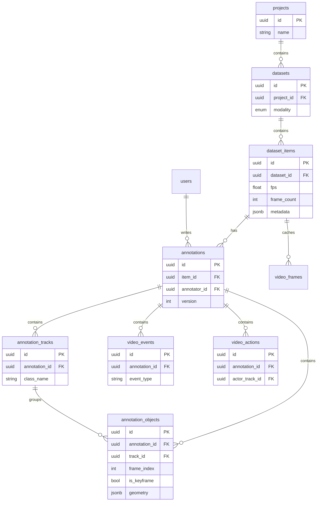

# MI-RA Studio — Video Module Data Model

**Phase 0 · Database / schema specification**  
Companion to `frontend/src/modules/video/VIDEO_ANNOTATION_SPEC.md`

---

## 1. Design principles

1. **Reuse platform tables** where they already support video (`dataset_items`, `annotations`, `annotation_objects`, `annotation_tracks`).
2. **Video = `DatasetItem`** with `dataset.modality = video` — no separate `videos` table in v1 (logical entity name remains *Video*).
3. **Time indexing:** prefer integer `frame_index` (0-based) plus derived `time_sec = frame_index / fps` for display and export.
4. **All primary keys:** UUID v4 (`UUID` PostgreSQL), generated server-side — matches existing `UUIDMixin`.
5. **Flexible geometry:** JSONB on `annotation_objects.geometry` (same as image).
6. **New tables** only where relational integrity or query patterns require it (events, actions, frame cache, camera groups).

---

## 2. Entity hierarchy (logical)

```
Organization
 └── Project                          [projects]
      └── Dataset                       [datasets]  modality=video
           └── Video (DatasetItem)     [dataset_items]
                ├── VideoProbe         → item.metadata (JSONB) + columns
                ├── Frames (cache)      [video_frames]  optional extracted JPEGs
                ├── Annotation         [annotations]  per annotator × version
                │    ├── Labels         → annotation.labels (file-level)
                │    ├── Objects        [annotation_objects]  per frame or span
                │    ├── Tracks         [annotation_tracks]
                │    ├── Keyframes      → objects where is_keyframe=true
                │    ├── Events         [video_events]
                │    ├── Actions        [video_actions]
                │    ├── Relations      → objects.linked_object_id / link_relation
                │    ├── Audio refs     → linked dataset_items or metadata
                │    └── QA             [qa_results] + [reviews]
                ├── DatasetVersion      [dataset_versions]
                └── Task / Assignment   [tasks] [assignments]
```

---

## 3. Identifier specification

| Entity | ID column | Type | Generator | Example scope |
|--------|-----------|------|-----------|---------------|
| **User** | `users.id` | UUID | Server UUID4 | Platform auth |
| **Project** | `projects.id` | UUID | Server UUID4 | Top-level workspace |
| **Dataset** | `datasets.id` | UUID | Server UUID4 | Video dataset container |
| **Video** | `dataset_items.id` | UUID | Server UUID4 | One video file / sequence |
| **Annotation** | `annotations.id` | UUID | Server UUID4 | One annotator revision on a video |
| **Object** | `annotation_objects.id` | UUID | Server UUID4 | Shape / span / detection on a frame or time range |
| **Track** | `annotation_tracks.id` | UUID | Server UUID4 | Identity across frames |
| **Keyframe** | Same as Object | — | — | `annotation_objects.id` where `is_keyframe = true` |
| **Event** | `video_events.id` | UUID | Server UUID4 | Timeline event (new table) |
| **Action** | `video_actions.id` | UUID | Server UUID4 | Action span (new table) |
| **Frame cache** | `video_frames.id` | UUID | Server UUID4 | Extracted frame asset (new table) |
| **Camera group** | `camera_groups.id` | UUID | Server UUID4 | Multi-camera sync (new table) |

**Client-side temporary IDs:** `clientId` (string UUID) in frontend state until save — same pattern as image studio.

**Human-readable labels (not PKs):**

| Label | Format | Example |
|-------|--------|---------|
| Track display | `T{n}` or schema-defined | `T1`, `person_001` |
| Object display | `{class}_{index}` | `car_003` |
| Event | `{type}_{index}` | `brake_002` |

---

## 4. Existing platform tables (video usage)

### 4.1 `projects`

| Column | Video usage |
|--------|-------------|
| `id` | Project ID |
| `name`, `slug`, `status` | Unchanged |
| `organization_id` | Tenant scope |

### 4.2 `datasets`

| Column | Video usage |
|--------|-------------|
| `id` | Dataset ID |
| `modality` | Must be `video` (or `multimodal`) |
| `project_id` | Parent project |
| `annotation_schema_id` | Label / tool definitions |
| `storage_mode` | `local` \| `server` \| `cloud` |
| `metadata` | Dataset-level tags, collection info |

### 4.3 `dataset_items` (logical **Video**)

| Column | Video usage |
|--------|-------------|
| `id` | **Video ID** |
| `dataset_id` | Parent dataset |
| `storage_path` | Video file location |
| `mime_type` | e.g. `video/mp4` |
| `duration_seconds` | From ffprobe |
| `frame_count` | From ffprobe or computed |
| `fps` | Rational FPS as float |
| `width`, `height` | Resolution |
| `file_size_bytes` | File size |
| `relative_path`, `parent_folder` | Folder organization |
| `thumbnail_path` | Poster frame |
| `preview_path` | Optional low-res proxy |
| `metadata` | **VideoProbe** payload (see §5) |
| `tags` | User tags |
| `status` | `pending` → `processing` → `ready` → … |

### 4.4 `annotations`

| Column | Video usage |
|--------|-------------|
| `id` | **Annotation ID** (revision container) |
| `item_id` | FK → video (`dataset_items.id`) |
| `annotator_id` | FK → user |
| `version` | Increment per save lineage |
| `status` | draft → submitted → approved … |
| `task_id` | Optional task link |
| `labels` | Clip-level / whole-video labels |
| `metadata` | Studio state, export hints |
| `duration_seconds` | Annotating time (optional) |

### 4.5 `annotation_objects` ( **Object** + **Keyframe** )

| Column | Video usage |
|--------|-------------|
| `id` | **Object ID** |
| `annotation_id` | Parent annotation |
| `track_id` | FK → `annotation_tracks.id` (nullable) |
| `class_name`, `tool_type` | Label + tool |
| `geometry` | See §6 |
| `frame_index` | **Required for per-frame shapes** (nullable for pure spans) |
| `is_keyframe` | `true` = user keyframe; `false` = interpolated or single-frame |
| `attributes` | Occlusion, confidence, source, etc. |
| `linked_object_id`, `link_relation` | **Relations** between objects |
| `confidence` | AI pre-label score |

**Keyframe rule:** A keyframe is an `annotation_object` row with `is_keyframe = true`. Non-keyframe rows may be materialized on export or computed client-side from interpolation.

### 4.6 `annotation_tracks` ( **Track** )

| Column | Video usage |
|--------|-------------|
| `id` | **Track ID** |
| `annotation_id` | Parent annotation |
| `track_label` | Display name |
| `class_name` | Object class |
| `attributes` | Color, interpolation mode, camera_id, etc. |

### 4.7 `qa_results` + `reviews`

Linked to `annotations.id` — unchanged platform QA workflow.

### 4.8 `dataset_versions`

Snapshot / tag for dataset at point in time — unchanged.

### 4.9 `tasks` + `assignments`

Work assignment to annotators — unchanged.

---

## 5. VideoProbe (`dataset_items.metadata`)

Stored after FFmpeg/ffprobe. Schema version `video_probe_v1`:

```json
{
  "probe_version": "1",
  "container": "mp4",
  "codec": "h264",
  "codec_long": "H.264 / AVC / MPEG-4 AVC / MPEG-4 part 10",
  "profile": "High",
  "pixel_format": "yuv420p",
  "color_space": "bt709",
  "bitrate_bps": 8500000,
  "aspect_ratio": "16:9",
  "display_aspect_ratio": "16:9",
  "fps": 29.97,
  "fps_rational": { "num": 30000, "den": 1001 },
  "duration_sec": 120.5,
  "frame_count": 3612,
  "width": 1920,
  "height": 1080,
  "audio": {
    "codec": "aac",
    "channels": 2,
    "sample_rate": 48000,
    "bitrate_bps": 128000
  },
  "gop": {
    "keyframe_interval_frames": 30,
    "keyframe_timestamps_sec": [0.0, 1.0, 2.0]
  },
  "rotation": 0,
  "has_audio": true
}
```

---

## 6. Geometry conventions (video)

Extends image geometry with optional temporal fields on the same JSONB object:

### Per-frame bbox (frame `n`)

```json
{
  "x": 100, "y": 80, "w": 120, "h": 90,
  "rotation": 0,
  "frame_index": 42,
  "time_sec": 1.401
}
```

### Temporal span (no single frame)

```json
{
  "start_frame": 100,
  "end_frame": 250,
  "start_sec": 3.33,
  "end_sec": 8.33
}
```

### Mask / polygon

Same as image, plus `frame_index` on the object row (not inside geometry required).

---

## 7. New tables (Phase 1+)

### 7.1 `video_frames` (optional frame cache)

| Column | Type | Notes |
|--------|------|-------|
| `id` | UUID PK | Frame cache row ID |
| `item_id` | UUID FK → dataset_items | Parent video |
| `frame_index` | INT | 0-based |
| `time_sec` | FLOAT | Derived |
| `storage_path` | VARCHAR | JPEG/WebP path |
| `width`, `height` | INT | Cached dimensions |
| `is_keyframe` | BOOL | From probe GOP |
| `created_at` | TIMESTAMP | |

Unique: `(item_id, frame_index)`

### 7.2 `video_events`

| Column | Type | Notes |
|--------|------|-------|
| `id` | UUID PK | **Event ID** |
| `annotation_id` | UUID FK | Parent annotation |
| `event_type` | VARCHAR | From schema |
| `label` | VARCHAR | Display |
| `frame_index` | INT NULL | Instant event |
| `time_sec` | FLOAT NULL | Instant event |
| `start_frame`, `end_frame` | INT NULL | Interval |
| `start_sec`, `end_sec` | FLOAT NULL | Interval |
| `attributes` | JSONB | |
| `created_at`, `updated_at` | TIMESTAMP | |

### 7.3 `video_actions`

| Column | Type | Notes |
|--------|------|-------|
| `id` | UUID PK | **Action ID** |
| `annotation_id` | UUID FK | |
| `action_class` | VARCHAR | e.g. `walk`, `pick_up` |
| `actor_track_id` | UUID FK NULL | → annotation_tracks |
| `target_object_id` | UUID FK NULL | → annotation_objects |
| `start_frame`, `end_frame` | INT | |
| `start_sec`, `end_sec` | FLOAT | |
| `attributes` | JSONB | |
| `created_at`, `updated_at` | TIMESTAMP | |

### 7.4 `camera_groups` (multi-camera, Phase 3)

| Column | Type | Notes |
|--------|------|-------|
| `id` | UUID PK | **Camera group ID** |
| `dataset_id` | UUID FK | |
| `name` | VARCHAR | |
| `sync_metadata` | JSONB | Master clock, offsets per camera |
| `created_at` | TIMESTAMP | |

### 7.5 `camera_group_items`

| Column | Type | Notes |
|--------|------|-------|
| `id` | UUID PK | |
| `camera_group_id` | UUID FK | |
| `item_id` | UUID FK → dataset_items | One camera’s video |
| `camera_label` | VARCHAR | e.g. `front`, `left` |
| `time_offset_sec` | FLOAT | Sync offset |

---

## 8. Relations graph

```
annotation_objects.linked_object_id  →  annotation_objects.id
annotation_objects.track_id          →  annotation_tracks.id
video_actions.actor_track_id         →  annotation_tracks.id
video_actions.target_object_id       →  annotation_objects.id
annotation_objects.frame_index       →  implicit frame in video
video_frames.item_id                 →  dataset_items.id
```

---

## 9. Versioning

| Version type | Mechanism |
|--------------|-----------|
| **Dataset version** | `dataset_versions` row + optional snapshot |
| **Annotation version** | `annotations.version` integer per `(item_id, annotator_id)` |
| **Schema version** | `annotation_schemas` + dataset FK |
| **Probe schema** | `metadata.probe_version` string |

Export bundles include: `dataset_id`, `item_id`, `annotation_id`, `version`, `exported_at`.

---

## 10. API surface (planned)

| Resource | Base path |
|----------|-----------|
| Video items | `/api/v1/dataset-items/` (existing) |
| Video probe | `/api/v1/video/{item_id}/probe` (new, module) |
| Frames | `/api/v1/video/{item_id}/frames` (new) |
| Annotations | `/api/v1/annotations/` (existing) |
| Events | `/api/v1/video/annotations/{id}/events` (new) |
| Actions | `/api/v1/video/annotations/{id}/actions` (new) |
| Export | `/api/v1/exports/` format=`mot`, `coco_video`, `cvat_video` |

---

## 11. Migration plan

| Step | Action |
|------|--------|
| M1 | No migration — use existing columns on `dataset_items` |
| M2 | Alembic: create `video_frames`, `video_events`, `video_actions` |
| M3 | Alembic: `camera_groups`, `camera_group_items` |
| M4 | Backfill `metadata` probe for existing video items on re-process |

---

## 12. ER diagram (core)



---

## 13. Metadata

```yaml
schema_version: "0.1.0"
module: video
phase: 0
frozen_date: "2026-08-19"
compatible_platform: mi-ra-studio v1
```
